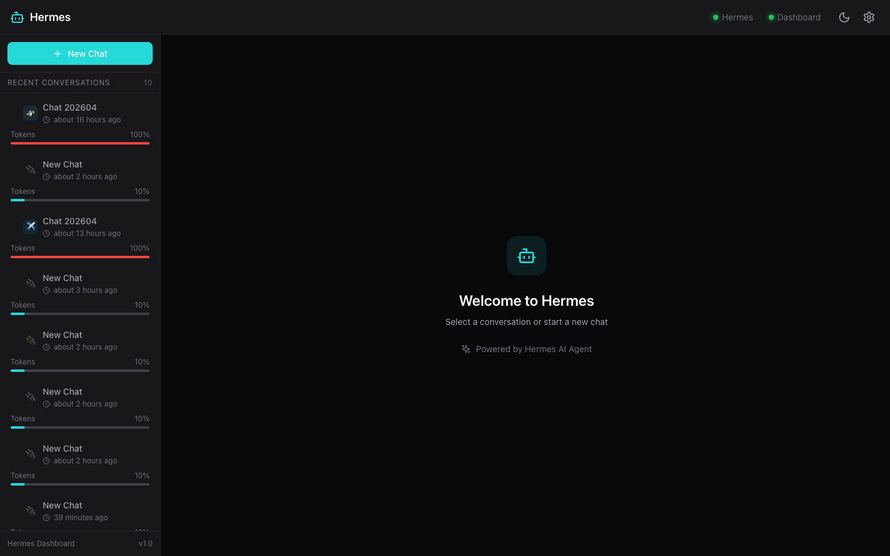

# Hermes Dashboard

[](https://opensource.org/licenses/MIT)
[](https://reactjs.org/)
[](https://www.typescriptlang.org/)
[](https://fastapi.tiangolo.com/)

A sleek, modern web dashboard for [Hermes AI Agent](https://github.com/hermes-ai).

> **Design Inspiration**: This project is heavily inspired by [PinchChat](https://github.com/MarlBurroW/pinchchat) for OpenClaw. The UI/UX design, layout concepts, and visual styling are based on PinchChat's excellent work, while the implementation is original and built specifically for the Hermes ecosystem.
>
> This is **not an official** PinchChat or Hermes project.



## ✨ Features

- 🎨 **Multiple Themes** — Dark, Light, and OLED modes with 6 accent colors
- 💬 **Real-time Chat** — WebSocket-based streaming responses
- 🔧 **Tool Visualization** — Collapsible tool calls with status badges
- 🤔 **Thinking Blocks** — Collapsible reasoning display with elapsed time
- 📜 **Session Management** — Drag & drop reorder, token usage bars
- 🎯 **Platform Icons** — Discord, Telegram, QQ, WeChat, API, Cron
- 📊 **Token Usage** — Visual progress bars per session
- 🖼️ **Image Support** — Inline images with click-to-preview
- 📱 **Responsive Design** — Works on different screen sizes
- ⚡ **Fast & Lightweight** — Built with Vite and FastAPI

## 🚀 Quick Start

### Prerequisites

- Python 3.9+
- Node.js 18+
- Hermes Gateway running on port 8642

### One-Line Start (Recommended)

```bash
cd /Users/mona/hermes-dashboard
./start.sh
```

Then open http://localhost:10007

### Manual Start

**1. Start Hermes Gateway**

```bash
hermes gateway run
```

**2. Start Bridge Server**

```bash
cd backend
python3 -m venv venv
source venv/bin/activate
pip install -r requirements.txt
python main.py
```

**3. Start Frontend**

```bash
cd frontend
npm install
npm run dev
```

**4. Open Dashboard**

Visit http://localhost:10007

## 🏗️ Architecture

```
┌─────────────────┐      WebSocket      ┌─────────────────┐
│   React App     │ ◄─────────────────► │  Bridge Server  │
│  (Port 10007)   │                     │  (Port 8643)    │
└─────────────────┘                     └────────┬────────┘
                           │                      │
                           │ HTTP + SSE           │ Read sessions
                    ┌──────▼──────┐              │
                    │ Hermes API  │              │
                    │ (Port 8642) │              │
                    └──────┬──────┘              │
                           │                     │
                    ┌──────▼──────┐              │
                    │ ~/.hermes   │◄─────────────┘
                    │ /sessions/* │    (jsonl files)
                    └─────────────┘
```

## ⚙️ Configuration

Edit `backend/.env` to customize:

```env
# Bridge Server
BRIDGE_HOST=0.0.0.0
BRIDGE_PORT=8643

# Hermes API
HERMES_API_URL=http://localhost:8642
HERMES_API_KEY=any

# Session files location
HERMES_HOME=/Users/mona/.hermes

# CORS Origins
CORS_ORIGINS=http://localhost:10007
```

## 🎨 Customization

### Themes

- **Dark** (default) — Zinc-based dark theme
- **Light** — Clean light theme
- **OLED** — Pure black for OLED screens

### Accent Colors

- Cyan (default)
- Violet
- Emerald
- Amber
- Rose
- Blue

Click the settings icon (⚙️) in the header to customize.

## 📁 Project Structure

```
hermes-dashboard/
├── backend/                  # Python FastAPI Bridge Server
│   ├── main.py              # FastAPI application
│   ├── models.py            # Pydantic models
│   ├── session_store.py     # Session file parser
│   ├── hermes_client.py     # Hermes API client
│   └── requirements.txt     # Python dependencies
├── frontend/                 # React + TypeScript + Vite
│   ├── src/
│   │   ├── components/      # React components
│   │   │   ├── Chat/        # Chat UI components
│   │   │   ├── Sidebar/     # Session list
│   │   │   └── Layout/      # Header, etc.
│   │   ├── services/        # API & WebSocket
│   │   ├── types/           # TypeScript types
│   │   ├── App.tsx          # Main app
│   │   └── index.css        # Global styles
│   ├── package.json
│   └── vite.config.ts
├── start.sh                 # One-click starter
├── README.md
├── LICENSE                  # MIT License
└── CONTRIBUTING.md          # Contribution guidelines
```

## 🔌 API Endpoints

### REST Endpoints

| Endpoint | Method | Description |
|----------|--------|-------------|
| `/api/health` | GET | Health check |
| `/api/sessions` | GET | List all sessions |
| `/api/sessions` | POST | Create new session |
| `/api/sessions/{id}` | GET | Get session details |
| `/api/sessions/{id}` | DELETE | Delete session |
| `/api/models` | GET | List available models |
| `/api/gateway/status` | GET | Hermes gateway status |

### WebSocket Endpoints

| Endpoint | Description |
|----------|-------------|
| `/ws/chat` | Real-time chat streaming |

## 🤝 Contributing

We welcome contributions! Please see [CONTRIBUTING.md](./CONTRIBUTING.md) for guidelines.

## 📜 License

MIT License — see [LICENSE](./LICENSE) for details.

## 🙏 Credits

- Inspired by [PinchChat](https://github.com/MarlBurroW/pinchchat) for OpenClaw
- Built for [Hermes AI Agent](https://github.com/hermes-ai)

## 🐛 Troubleshooting

### Hermes Gateway not running

```bash
curl http://localhost:8642/health
hermes gateway run
```

### Bridge Server won't start

```bash
lsof -i :8643
# Kill existing process or change port in backend/.env
```

### Frontend can't connect

```bash
curl http://localhost:8643/api/health
# Check vite.config.ts proxy settings
```

## 📸 Screenshots

*Coming soon*

---

Made with ❤️ for the Hermes community
