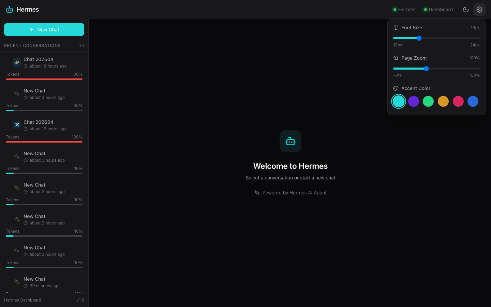
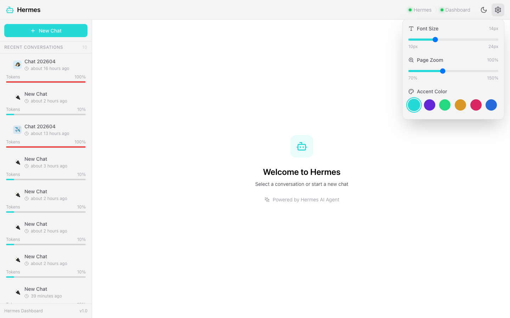
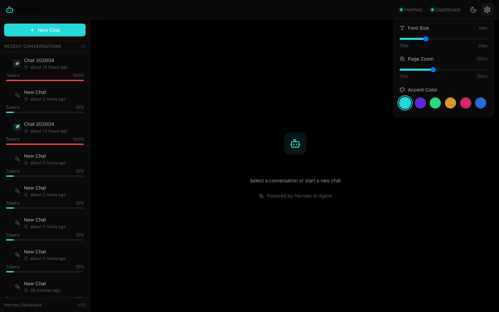

# Hermes Dashboard

[](https://opensource.org/licenses/MIT)
[](https://reactjs.org/)
[](https://www.typescriptlang.org/)
[](https://fastapi.tiangolo.com/)

A sleek, modern web dashboard for [Hermes AI Agent](https://github.com/hermes-ai).

> **Design Inspiration**: This project is heavily inspired by [PinchChat](https://github.com/MarlBurroW/pinchchat) for OpenClaw. The UI/UX design, layout concepts, and visual styling are based on PinchChat's excellent work, while the implementation is original and built specifically for the Hermes ecosystem.
>
> This is **not an official** PinchChat or Hermes project.


## ✨ Features

- 🎨 **Multiple Themes** — Dark, Light, and OLED modes with 6 accent colors
- 💬 **Real-time Chat** — WebSocket-based streaming responses
- 🔧 **Tool Visualization** — Collapsible tool calls with status badges
- 🤔 **Thinking Blocks** — Collapsible reasoning display with elapsed time
- 📜 **Session Management** — Drag & drop reorder, token usage bars
- 🎯 **Platform Icons** — Discord, Telegram, QQ, WeChat, API, Cron
- 📊 **Token Usage** — Visual progress bars per session
- 🖼️ **Image Support** — Inline images with click-to-preview
- 📱 **Responsive Design** — Works on different screen sizes
- ⚡ **Fast & Lightweight** — Built with Vite and FastAPI

## 🚀 Quick Start

### Prerequisites

- Python 3.9+
- Node.js 18+
- Hermes Gateway running on port 8642

### One-Line Start (Recommended)

```bash
cd /Users/mona/hermes-dashboard
./start.sh
```

Then open http://localhost:10007

### Manual Start

**1. Start Hermes Gateway**

```bash
hermes gateway run
```

**2. Start Bridge Server**

```bash
cd backend
python3 -m venv venv
source venv/bin/activate
pip install -r requirements.txt
python main.py
```

**3. Start Frontend**

```bash
cd frontend
npm install
npm run dev
```

**4. Open Dashboard**

Visit http://localhost:10007

## 🏗️ Architecture

```
┌─────────────────┐      WebSocket      ┌─────────────────┐
│   React App     │ ◄─────────────────► │  Bridge Server  │
│  (Port 10007)   │                     │  (Port 8643)    │
└─────────────────┘                     └────────┬────────┘
                           │                      │
                           │ HTTP + SSE           │ Read sessions
                    ┌──────▼──────┐              │
                    │ Hermes API  │              │
                    │ (Port 8642) │              │
                    └──────┬──────┘              │
                           │                     │
                    ┌──────▼──────┐              │
                    │ ~/.hermes   │◄─────────────┘
                    │ /sessions/* │    (jsonl files)
                    └─────────────┘
```

## ⚙️ Configuration

Edit `backend/.env` to customize:

```env
# Bridge Server
BRIDGE_HOST=0.0.0.0
BRIDGE_PORT=8643

# Hermes API
HERMES_API_URL=http://localhost:8642
HERMES_API_KEY=any

# Session files location
HERMES_HOME=/Users/mona/.hermes

# CORS Origins
CORS_ORIGINS=http://localhost:10007
```

## 🎨 Customization

### Themes

- **Dark** (default) — Zinc-based dark theme
- **Light** — Clean light theme
- **OLED** — Pure black for OLED screens

### Accent Colors

- Cyan (default)
- Violet
- Emerald
- Amber
- Rose
- Blue

Click the settings icon (⚙️) in the header to customize.

## 📁 Project Structure

```
hermes-dashboard/
├── backend/                  # Python FastAPI Bridge Server
│   ├── main.py              # FastAPI application
│   ├── models.py            # Pydantic models
│   ├── session_store.py     # Session file parser
│   ├── hermes_client.py     # Hermes API client
│   └── requirements.txt     # Python dependencies
├── frontend/                 # React + TypeScript + Vite
│   ├── src/
│   │   ├── components/      # React components
│   │   │   ├── Chat/        # Chat UI components
│   │   │   ├── Sidebar/     # Session list
│   │   │   └── Layout/      # Header, etc.
│   │   ├── services/        # API & WebSocket
│   │   ├── types/           # TypeScript types
│   │   ├── App.tsx          # Main app
│   │   └── index.css        # Global styles
│   ├── package.json
│   └── vite.config.ts
├── start.sh                 # One-click starter
├── README.md
├── LICENSE                  # MIT License
└── CONTRIBUTING.md          # Contribution guidelines
```

## 🔌 API Endpoints

### REST Endpoints

| Endpoint | Method | Description |
|----------|--------|-------------|
| `/api/health` | GET | Health check |
| `/api/sessions` | GET | List all sessions |
| `/api/sessions` | POST | Create new session |
| `/api/sessions/{id}` | GET | Get session details |
| `/api/sessions/{id}` | DELETE | Delete session |
| `/api/models` | GET | List available models |
| `/api/gateway/status` | GET | Hermes gateway status |

### WebSocket Endpoints

| Endpoint | Description |
|----------|-------------|
| `/ws/chat` | Real-time chat streaming |

## 🤝 Contributing

We welcome contributions! Please see [CONTRIBUTING.md](./CONTRIBUTING.md) for guidelines.

## 📜 License

MIT License — see [LICENSE](./LICENSE) for details.

## 🙏 Credits

- Inspired by [PinchChat](https://github.com/MarlBurroW/pinchchat) for OpenClaw
- Built for [Hermes AI Agent](https://github.com/hermes-ai)

## 📱 Mobile Access

Access Hermes Dashboard from your mobile device:

### Quick Setup

1. **Ensure your phone and computer are on the same WiFi network**

2. **Get your computer's IP address:**
   ```bash
   # macOS
   ipconfig getifaddr en0
   # or
   ifconfig | grep "inet " | grep -v 127.0.0.1
   ```

3. **Access from your phone:**
   ```
   http://[YOUR_COMPUTER_IP]:10007
   # Example: http://192.168.1.100:10007
   ```

### Install as PWA App

**iOS (Safari):**
1. Open the website in Safari
2. Tap the Share button
3. Select "Add to Home Screen"
4. The app will appear on your home screen

**Android (Chrome):**
1. Open the website in Chrome
2. Tap the menu (three dots)
3. Select "Install App" or "Add to Home Screen"

### HTTPS for Secure Access (Optional)

> **Note**: The simplified configuration uses HTTP only. For HTTPS (if needed in production):

```bash
# 1. Generate SSL certificates
cd backend
./generate-ssl.sh

# 2. Enable HTTPS in .env
sed -i '' 's/USE_HTTPS=false/USE_HTTPS=true/' .env

# 3. Restart the server
# Access via https://[IP]:10007
```

### Mobile-Optimized Features

- **Responsive Design**: Automatically adapts to mobile screen sizes
- **Bottom Navigation Bar**: Quick access to sessions and new chat
- **Touch-Friendly**: Buttons and controls optimized for touch input
- **Swipe Gestures**: Swipe to open sidebar on mobile
- **Offline Support**: PWA caching for better performance

### Troubleshooting Mobile Access

See [README_MOBILE.md](README_MOBILE.md) for detailed troubleshooting guide.

---

## 🐛 Troubleshooting

### Hermes Gateway not running

```bash
curl http://localhost:8642/health
hermes gateway run
```

### Bridge Server won't start

```bash
lsof -i :8643
# Kill existing process or change port in backend/.env
```

### Frontend can't connect

```bash
curl http://localhost:8643/api/health
# Check vite.config.ts proxy settings
```

## 📸 Screenshots


*主界面 - 暗黑主题*


*设置面板 - 支持字体大小、页面缩放、主题切换*


*亮色主题*


*OLED 纯黑主题*

---

Made with ❤️ for the Hermes community

---

## ⚠️ Mobile Access Risk Warning

> **Important Notice**: Mobile access features are provided for development and testing purposes only. Please read the following risks carefully before use.

### 🚨 Known Issues and Risks

#### 1. Connection May Fail
- **Network Environment**: Mobile and computer must be on the **same WiFi network**, but some routers/network environments may block internal communication
- **Firewall**: macOS/Windows firewalls may block external access to port 10007/8643
- **Mobile Hotspot**: Some mobile hotspots do not allow device-to-device communication

#### 2. Security Risks of HTTP Mode
- **Current Configuration**: This simplified version uses HTTP only (not HTTPS)
- **Risk Description**: HTTP transmits data in plain text and may be intercepted in public WiFi environments
- **Recommendation**: Use only in trusted home networks, do not use in public WiFi

#### 3. HTTPS Certificate Issues (If HTTPS Enabled)
- **Self-signed Certificate**: Mobile browsers will display security warnings
- **iOS**: Need to manually install and trust certificate files
- **Android**: Different brands of phones have different operating methods
- **Validity Period**: Self-signed certificates usually have a validity period and need to be regenerated periodically

#### 4. CORS Configuration Issues
- **Error Manifestation**: Browser console shows `Access-Control-Allow-Origin` related errors
- **Solution**: Need to manually add the phone's IP address to `backend/.env`'s `CORS_ORIGINS`
- **Dynamic IP**: If the computer's IP changes, need to reconfigure

### ✅ Troubleshooting Steps

If mobile access fails, please check in order:

1. **Confirm All Services Running**
   ```bash
   # Check frontend
   curl http://localhost:10007
   
   # Check backend
   curl http://localhost:8643/api/health
   ```

2. **Get Correct IP Address**
   ```bash
   # macOS
   ipconfig getifaddr en0
   
   # Should return IP in the format 192.168.x.x or 10.x.x.x
   # Do NOT use 127.0.0.1 or localhost
   ```

3. **Test from Computer**
   ```bash
   # Use the obtained IP
   curl http://YOUR_IP:10007
   ```

4. **Check Firewall**
   - macOS: System Settings -> Network -> Firewall
   - Temporarily disable for testing

5. **Confirm Same WiFi**
   - Phone and computer must be connected to the same WiFi
   - Some corporate/educational networks may block internal communication

### 📖 More Documentation

- **Quick Start**: [MOBILE_QUICKSTART.md](MOBILE_QUICKSTART.md)
- **Detailed Guide**: [README_MOBILE.md](README_MOBILE.md)
- **Troubleshooting**: [MOBILE_TROUBLESHOOTING.md](MOBILE_TROUBLESHOOTING.md)

### ⚠️ Disclaimer

Mobile access features are for development and testing purposes only. The authors are not responsible for any security issues, data leaks, or other losses that may result from using this feature. Please use with caution in production environments.

